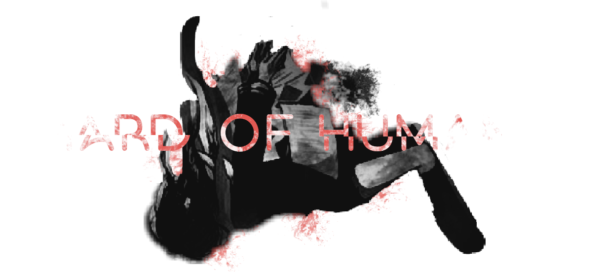

<h1 align=center>
    
</h1>

## **Introduction**
_Shard of Humanity*_ is a visual novel based on [Everlasting Summer*](https://store.steampowered.com/app/331470/Everlasting_Summer/) by [Soviet Games*](https://sovietgames.su/?lang=en) and RUVN Community licensed under [GNU Affero General Public License 3.0](LICENSE.md).

## **History**
Game (mod) were made by ukrainian developers, **NGTM** (nitrogen team), which previously was named Prototype TM.

Team was renamed because of it's founder death, so as mod by itself. Previously _Shard of Humanity*_ was called _Project OWL_, but it lost it's concepts with, again, death of it's founder.

Game by itself is a kind of rebirth of [Project OWL*](https://vk.com/awwixo) and follows the rules of founder's scenario style.

## **Installation**
1. Install Everlasting Summer. Doesn't matter which version Steam or Non-Steam.
2. Download repo or get latest release at [Releases](https://github.com/nitrogenez/shard-of-humanity/releases) page.
3. Move .zip contents into "[your-installation-path]/game/mods"
4. Run modification through menu.